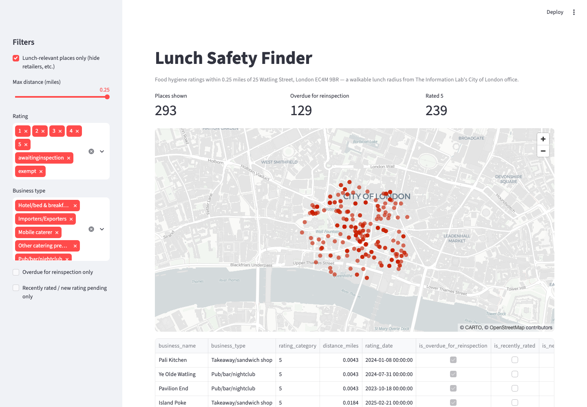

# Lunch Safety Finder

> **Note:** This is a worked example built by The Information Lab to show
> Data Engineering School candidates what a strong submission looks like -
> not a real applicant's project. See "Where AI helped" below for how it was
> actually built.

## What I built and who for
A tool for office workers near The Information Lab's City of London office (25 Watling Street, EC4M 9BR) deciding where to eat lunch. It pulls UK Food Hygiene Rating Scheme data for everywhere within a 0.25-mile walk of the office, models it into one clean table, and surfaces it in a small app with two things a generic ratings list won't give you: places **overdue for reinspection** and places with a **recently changed or pending rating**.



## The data
[FSA Food Hygiene Rating Scheme (FHRS) API](https://api.ratings.food.gov.uk/help) — free, no API key or registration required (just a required `x-api-version: 2` header). Published under the Open Government Licence.

Pulled via the `Establishments` endpoint, searching by distance from the office's coordinates (geocoded once via [postcodes.io](https://postcodes.io)) and sorted by proximity.

**A quirk worth flagging:** the API's `maxDistanceLimit` parameter is accepted but doesn't actually filter results server-side — `meta.totalCount` stays at the full nationwide count (~15,800) no matter what value you pass. Only `sortOptionKey=distance` does anything, and it sorts the *entire* dataset. So the extraction script pages through the distance-sorted results itself and stops once a page's closest establishment falls outside the radius — the real filtering happens in SQL, not at the API.

## How it works
Three layers, all inside `data/lunch_safety.duckdb`, built by `sql/run_models.py`:

1. **`raw_establishments`** (`sql/01_raw.sql`) — loads every committed file in `data/raw/` and unnests the `establishments` array into one row per establishment, tagged with its source file.
2. **`stg_establishments`** (`sql/02_staging.sql`) — typed, renamed, cleaned. This is also where the real radius cutoff happens (`WHERE Distance <= 0.25`), since the API doesn't enforce it. `RatingValue` comes back as text because it isn't always numeric: England/Wales/NI (`FHRS` scheme) use 0-5, but Scotland (`FHIS` scheme) uses `Pass`/`Improvement Required`, and anything awaiting its first inspection uses `AwaitingInspection`/`Exempt` regardless of scheme. `TRY_CAST` turns the non-numeric cases into `NULL` rather than erroring — correct, since those establishments genuinely have no numeric rating. Nothing in this pull is actually Scottish, but the model handles `FHIS` correctly anyway rather than assuming England-only data forever.
3. **`mart_establishments`** (`sql/03_marts.sql`) — one row per `fhrsid`, deduplicated across every raw snapshot pulled so far (`ROW_NUMBER() OVER (PARTITION BY fhrsid ORDER BY rating_date DESC, _source_file DESC)`), plus the derived columns the app uses:
   - `is_lunch_relevant` — the raw pull also includes supermarkets, importers/exporters and a school; this flags the business types you'd actually get lunch from.
   - `is_overdue_for_reinspection` — no rating in the last 18 months. A simple, deliberately-flat proxy: the FSA's real inspection frequency is risk-based (6-24+ months depending on premises risk), not a fixed interval.
   - `is_new_rating_pending` — a direct passthrough of the API's own `NewRatingPending`, the most defensible "about to change" signal available.
   - `is_recently_rated` — rated in the last 3 months.

**Idempotency:** every model does a full `CREATE OR REPLACE TABLE` rebuild from *all* committed raw files, every run — no incremental merge. At a few hundred rows this costs milliseconds and is trivially correct: re-running against unchanged raw data reproduces an identical table (verified — see the two raw snapshots in `data/raw/`, pulled ~20 minutes apart, both rebuild to the same 332-row mart), and a new snapshot deterministically keeps the most recent record per establishment.

**What genuine "rating changed" detection would need:** raw files are immutable and timestamped specifically so this is possible later — a self-join of the two most recent snapshots per `fhrsid` would catch a real change. With this project's timeframe that's more machinery than the payoff justifies, so it's deferred (see below) and the three proxy flags above stand in for it.

## How to run it
```
git clone <repo> && cd <repo>
python -m venv .venv && source .venv/bin/activate
pip install -r requirements.txt

python sql/run_models.py            # builds data/lunch_safety.duckdb from the committed raw JSON - no network needed
streamlit run app/lunch_safety_app.py

# optional, needs network - refreshes data/raw/ from the live API:
python extract/fetch_establishments.py
```
No credentials of any kind are needed — the FHRS API requires none.

Run the tests with `python -m pytest tests/` (checks: mart has rows, no duplicate `fhrsid`, no unexpected nulls, everything within the search radius, rating category matches the numeric rating).

## What I would do next
- Parameterise the office location instead of hardcoding one address, so the same pipeline works for any office.
- True run-over-run change detection (self-join across raw snapshots) instead of the three proxy flags, once there's enough raw history to make it worthwhile.
- Switch the reinspection threshold from a flat 18 months to something risk-band-aware, using `BusinessTypeID` as a rough proxy for inspection frequency.
- Move from full-rebuild to incremental if the raw history grows large enough that milliseconds stop being milliseconds.

## Where AI helped
This project was built end-to-end with Claude Code, directed by The Information Lab's Data Engineering School team. AI handled the research (confirming the FHRS API needs no auth, discovering the `maxDistanceLimit`/`sortOptionKey` behaviour above by testing real requests since the docs don't mention it), the technical design (the raw/staging/mart split, the idempotency strategy, the flag logic), and the implementation. The human side of this was choosing the API/topic and the lunch-near-the-office persona, reviewing and approving the plan before any code was written, and verifying the results — the test suite passing, and the mart staying at 332 rows across two real raw pulls taken ~20 minutes apart — rather than hand-writing the code.

We're showing this process deliberately: candidates are expected to use AI too, and what we look for is whether you understand and can explain what you've made, not whether you typed every line yourself.
